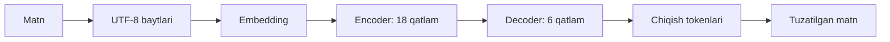

# UzNorm arxitekturasi

UzNorm — `google/byt5-base` asosida full fine-tuning qilingan, UTF-8 baytlarida ishlaydigan encoder–decoder Transformer.

| Xususiyat | Qiymat |
|---|---:|
| Parametrlar | 581 653 248 |
| Encoder / decoder | 18 / 6 |
| d_model / d_ff | 1536 / 3968 |
| Attention heads | 12 |
| d_kv | 64 |
| Vocabulary | 384 byte/special ID; 384 so‘z emas |
| Feed-forward | gated-GELU |

Decoder masked self-attention bilan avvalgi javobga, cross-attention bilan encoder chiqishiga qaraydi. Matn baytlar bo‘yicha ketma-ket hosil bo‘ladi. Barcha trening bosqichlarida arxitektura bir xil, vaznlar esa yangilangan. LoRA adapteri ishlatilmagan.

## Lokal dastur

`web/dist/` interfeys → `web_server.py` loopback HTTP → `service.py` → tekshirilgan model.

`artifacts.py` import/hash/lineage tekshiruvini bajaradi. `metrics.py` va `evaluation.py` saytdan alohida baholashga xizmat qiladi. Model lazy-load qilinadi, sessiyada qayta ishlatiladi. Input matni oddiy server logiga yozilmaydi.

Server internetga deploy qilish uchun tayyor hosting xizmati emas. Faqat `127.0.0.1`, origin/host tekshiruvi va sessiya tokeni bilan ishlaydi. Har so‘rovda model vaznlari o‘zgarmaydi.

Manba: [Google ByT5 model card](https://huggingface.co/google/byt5-base), [ByT5 maqolasi](https://arxiv.org/abs/2105.13626). Baytli arxitektura imkoniyati barcha xatolarni to‘g‘ri tuzatish kafolati emas; amaliy natija dataset va fine-tuningga bog‘liq.
